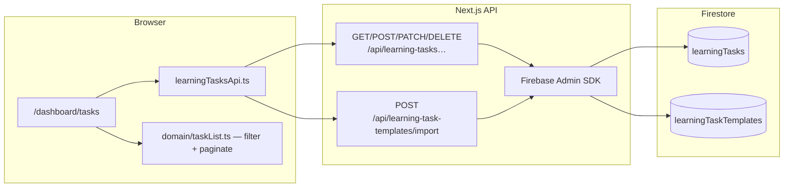
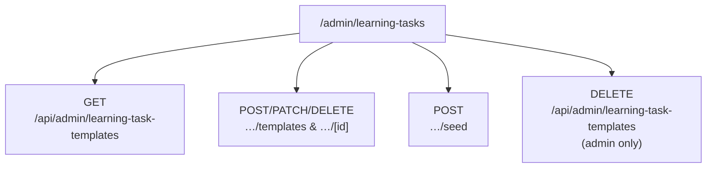

# 09 · Learning tasks — architecture & flows

Private **checklists** for each attendee (`learningTasks`) plus an organiser-maintained **template catalogue** (`learningTaskTemplates`). All reads and writes for personal tasks go through **Next.js API routes** with Firebase ID tokens and the **Admin SDK**; Firestore rules provide a second boundary for any future client access patterns.

---

## Responsibilities at a glance

| Piece | Role |
|-------|------|
| **`learningTaskTemplates`** | Shared catalogue rows (session, title, category, sort order, active flag). Edited by admins/moderators via **`/admin/learning-tasks`**. |
| **`learningTasks`** | One document per checklist item **per user**; `userId` must equal the signed-in user for API queries and rule checks. |
| **`src/lib/learningTasksApi.ts`** | Browser helper: Bearer header on every call. |
| **`src/features/learning-tasks/`** | UI components + **pure domain** helpers (filters, pagination size, category presets) — no Firebase imports. |
| **`src/lib/server/learningTasksFirestore.ts`** | Serialisation + `deriveSessionOrder()` for API handlers. |
| **`src/data/learningTaskTemplatesSeed.ts`** | Stable ids merged by **`POST /api/admin/learning-task-templates/seed`**. |

---

## End-user flow (`/dashboard/tasks`)



1. User opens **`/dashboard/tasks`** (must be signed in; dashboard routes are guarded).
2. Client loads **`GET /api/learning-tasks`** → server runs `learningTasks.where("userId", "==", uid)` ordered by `sessionOrder`, `sortOrder`.
3. If the list is **empty**, the page calls **`POST /api/learning-task-templates/import`** with `{ importAllActive: true }` to copy active templates into **`learningTasks`** (skipping duplicates via `sourceTemplateId` where applicable).
4. **CRUD** uses **`POST /api/learning-tasks`**, **`PATCH` / `DELETE /api/learning-tasks/[id]`**. Priority, progress, notes, category (including custom strings), session fields, and audit labels are persisted server-side.

### UX behaviour (high level)

- **Views:** table, grouped cards, timeline (timeline shows all **filtered** tasks; table/cards **paginate** — page size from `LEARNING_TASKS_PAGE_SIZE` in `domain/taskList.ts`).
- **Filters:** search (title + notes), session, priority, progress — implemented client-side on the already user-scoped list.
- **Categories:** creatable tag-style picker; presets + custom strings validated on the API (`learningCategorySchema`).

---

## Organiser flow (`/admin/learning-tasks`)



| Action | Who | Notes |
|--------|-----|--------|
| List / create / edit row / toggle active / delete one | Admin **or** moderator | `requireAdmin` allows both roles. |
| **Re-seed defaults** | Admin **or** moderator | Upserts rows from seed file by **stable document id** (`merge`). |
| **Clear catalogue** | **Admin only** | Deletes **all** `learningTaskTemplates` documents (batched). Does **not** delete attendee **`learningTasks`**. |
| **Reset to defaults** | **Admin only** | Clear catalogue, then seed. |

Seed data lives in **`src/data/learningTaskTemplatesSeed.ts`**. Session labels for presets align with **`src/data/sessions.ts`** via the attendee dashboard’s session picker.

---

## Security summary

- **Bearer token** required on all `/api/learning-tasks*` and `/api/learning-task-templates*` routes used by the app.
- **GET list** for tasks always filters **`userId == auth.uid`** on the server.
- **Firestore rules:** `learningTasks` — read/update/delete only when `resource.data.userId == request.auth.uid`; create only when `request.resource.data.userId == request.auth.uid`. **`learningTaskTemplates`** — read any signed-in user; write admin/moderator.

Details: [04-auth-and-security.md](./04-auth-and-security.md), collection shapes and indexes: [03-database-schema.md](./03-database-schema.md), endpoint tables: [07-api-routes.md](./07-api-routes.md).

---

## Source layout (reference)

```
src/app/dashboard/tasks/page.tsx          ← Main attendee UI
src/app/admin/learning-tasks/page.tsx     ← Catalogue admin UI
src/app/api/learning-tasks/
src/app/api/learning-tasks/[id]/
src/app/api/learning-task-templates/
src/app/api/learning-task-templates/import/
src/app/api/admin/learning-task-templates/
src/app/api/admin/learning-task-templates/[id]/
src/app/api/admin/learning-task-templates/seed/
src/features/learning-tasks/
  components/LearningTasksListControls.tsx
  components/LearningTaskCategoryPicker.tsx
  domain/taskList.ts
  domain/categoryPresets.ts
src/lib/learningTasksApi.ts
src/lib/server/learningTasksFirestore.ts
src/lib/server/learningTaskActor.ts        ← resolved actor labels for audit fields
```

---

← Back to [README.md](./README.md)
