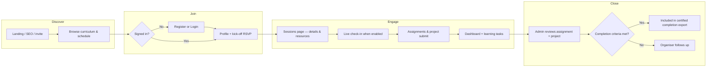
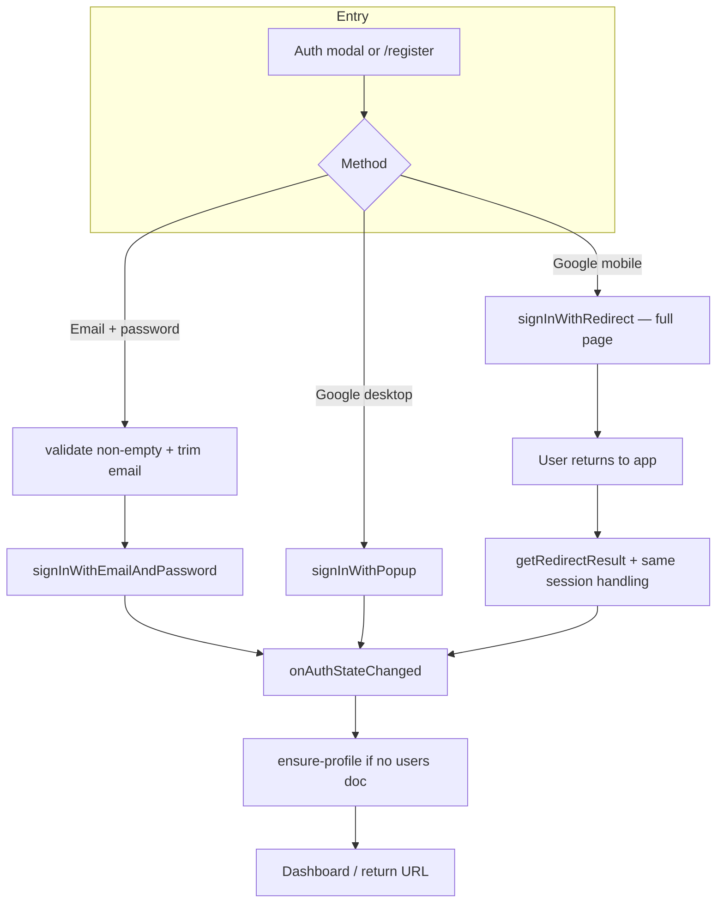
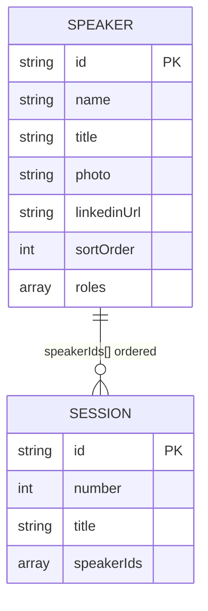
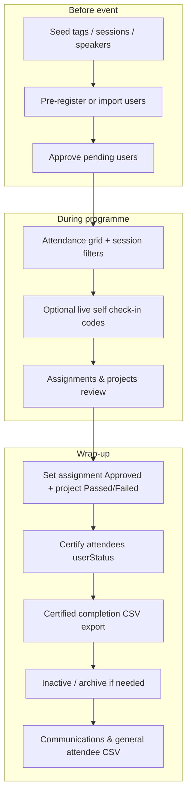
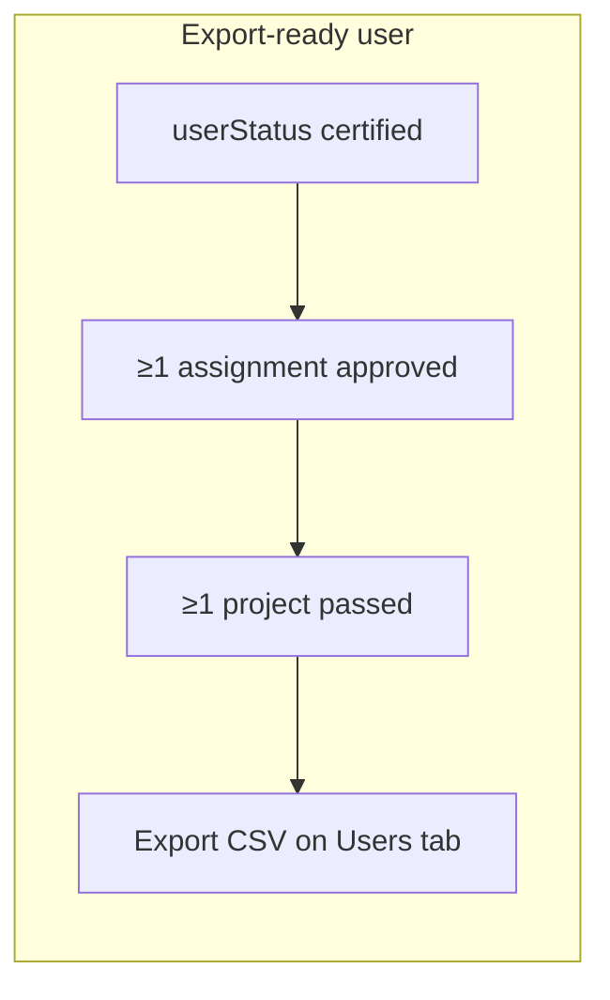

# 10 · Customer journey & programme flows

This document describes **attendee and organiser journeys** at a product level, with **diagrams** you can render in any Mermaid-capable viewer (GitHub, Notion, VS Code preview).

**Related:** data model for roster & sessions — [03-database-schema.md](./03-database-schema.md); auth (including mobile Google) — [04-auth-and-security.md](./04-auth-and-security.md); deployment & admin ops — [08-site-deployment-and-admin.md](./08-site-deployment-and-admin.md).

---

## Participant journey (happy path)

Typical path from discovery to programme completion.

**Content gating (sessions):** Rich materials and recordings on **`/sessions`** are limited to users whose **`userStatus`** is in the approved set (e.g. `participated` / `certified`) — see the sessions page implementation. Users with **`userStatus: "failed"`** (programme track) see a reduced experience on **`/sessions`** (no rich content). The **public home page** shows the high-level **schedule** and **Speakers & mentors** roster (from Firestore, with static fallback if the DB is empty).

### Completion criteria (organiser view)

A participant appears in the **export-ready** cohort when **all** of the following are true:

| Criterion | Where it is set |
|-----------|-----------------|
| Certified for attendance | `users.userStatus = "certified"` (bulk ≥70% sessions on **Attendance**, or manual status in **Users**) |
| At least one approved assignment | **Assignments** tab → status **Approved** |
| Final project passed | **Projects** tab → status **Passed** |

**Export:** **Admin → Users** → **Certified completion — export ready** → **Export CSV**. See [08-site-deployment-and-admin.md](./08-site-deployment-and-admin.md#certified-completion-export-operator-checklist).

**Distinction:** **Project `failed`** means the final submission did not meet requirements; **`userStatus: "failed"`** means the participant did not complete the programme (e.g. very low attendance). They are independent fields.

---

## Auth journey (sign-in & registration)

Email/password and Google are both supported. **Mobile browsers** (iPhone, iPad, Android) use **Google sign-in with redirect** instead of a popup, because popups are often blocked and can surface confusing Firebase errors (e.g. `auth/argument-error` when arguments are invalid, or `auth/popup-blocked`).

**Password reset:** From the modal (forgot link) or `/?login=1&reset=1` — `sendPasswordResetEmail` with a **valid https** continue URL when configured.

---

## Programme data: sessions & speaker roster

Sessions and the **people** on the programme are modelled separately for reuse (same person can appear on several sessions; home page “Speakers & mentors” is driven by the roster).

- **`speakers/{id}`** — Roster (name, title, photo path, optional LinkedIn, `sortOrder`, `roles`).
- **`sessions/{id}`** — `speakerIds: string[]` in **speaking order**; legacy embedded `speakers[]` / `speaker` fields are still read for old documents but new edits go through the roster.

**Seeding & sync:** Defaults live in `src/data/speakers.ts` and `src/data/sessions.ts`. Admins can **Import default sessions** (seeds **speakers** first, then **sessions**). Operators can also run **`npm run sync-firestore-programme`** to merge the same defaults via the Admin SDK (see [08](./08-site-deployment-and-admin.md)).

---

## Organiser (admin) journey

---

## Where this is implemented (quick map)

| Journey step | Primary UI / API |
|--------------|------------------|
| Public schedule & roster | `src/app/page.tsx`, `useSessions` + `useSpeakers`, `src/data/*.ts` fallback |
| Sign-in / register | `AuthModal`, `/register`, `src/lib/auth.ts` (`loginWithGoogle`, `preferGoogleRedirect`) |
| Session detail & gating | `/sessions`, `getSessionSpeakersList` + speaker lookup |
| Admin sessions & roster | `/admin` → Sessions, `SessionEditor`, `speakerService` / `sessionService` |
| Assignment / project review | `/admin` → Assignments, Projects; `PATCH /api/assignments/[id]`, `PATCH /api/projects/[id]` |
| Certified completion export | `/admin` → Users panel; `buildCertifiedCompletionAudit`, `exportCertifiedCompletionCsv` |
| Self check-in | `/sessions` expanded card, `POST /api/me/attendance/self-check-in` |

---

Next → back to [docs README](./README.md) or [01-project-overview.md](./01-project-overview.md).
